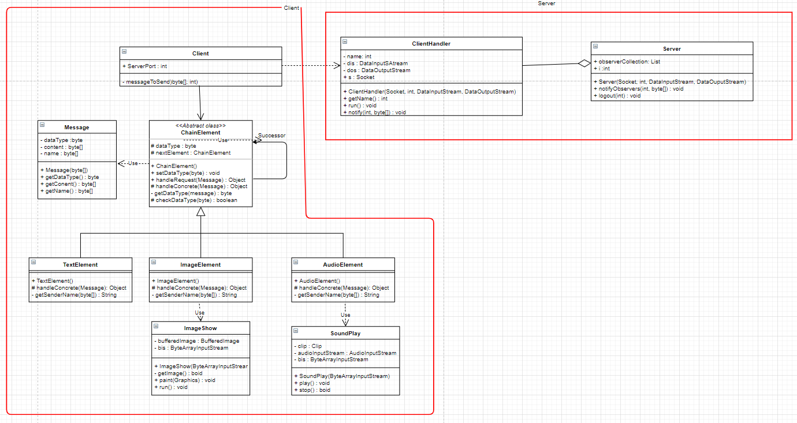

# Broadcast messenger
Messenger created as a project for studies. Simple broadcast messenger to send text messages, images (.jpg format) or sound files (.wav format) from one client to all clients connected to server
.
## Table of contents
* [Technologies](#technologies)
* [Run application](#how-to-run)
* [Features](#features)
* [Design patterns](#used-design-patterns)
* [UML Diagram](#uml-diagram)

## Technologies
Java 15

## How to run
### Run server (Only one)
```
$ javac Server.java
$ java Server
```

### Run client/s
```
$ javac Client.java
$ java Client
```

## Features
### Send text message (client window)
The client can send a message(with the generated information about who sent it), that will be delivered to all clients connected to the server
#### How to send message:
```
$ text
$ This is a message
```
#### How other clients will see this message:
```
$ Client 1: This is a message
```

### Send .jpg file from jpg folder (client window)
The client can send a photos in .jpg format. Other clients will receive information about the author of message and image will open in external window
#### How to send picture (To the test you can send 1.jpg image available in repository):
```
$ image
$ image_name.jpg
```
#### Information about author will appear as:
```
$ Received image from client 1
```

### Send sound file from wav folder (client window)
The client can send a sound file in .wav format. Other clients will receive information about the author of the message and  the sound will play.
#### How to send picture (To the test you can send sound.wav file available in repository):
```
$ sound
$ sound.wav
```
#### Information about author will appear as:
```
$ Received audio file from client 1
```

### Disconnect client from server
To disconnect client just type:
```
$ logout
```

## Used design patterns:
- **Observer** : After each received message by Server, all other clients connected to the server are notified using notifyObservers() method in the Server class
- **Chain Element** : Allows requests to be forwarded to subsequent object along the chain(TextElement -> ImageElement -> AudioElement), when that object is not responsible for the received event
- **Template method pattern** : Creates a skeleton of the algorithm and allows the subclasses to override methods of parent class except template method

## UML diagram
